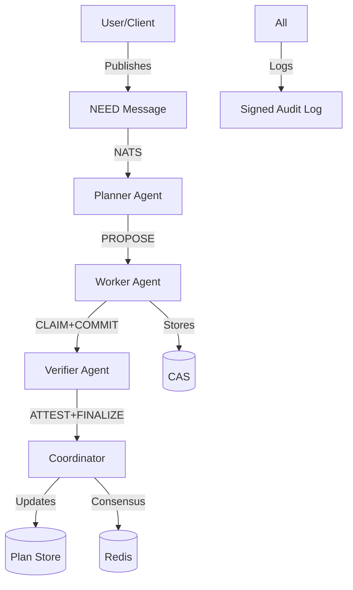
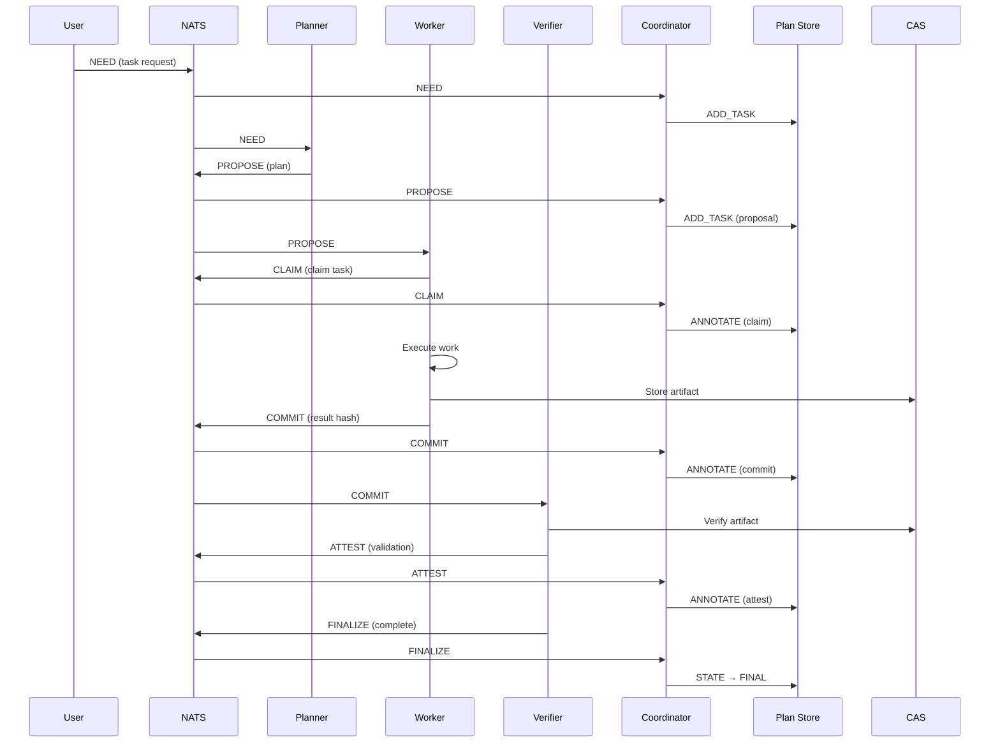
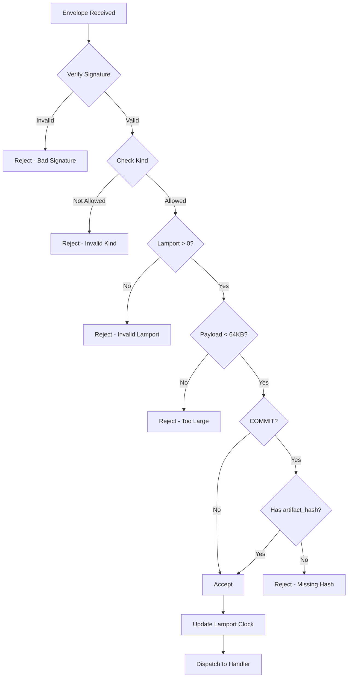
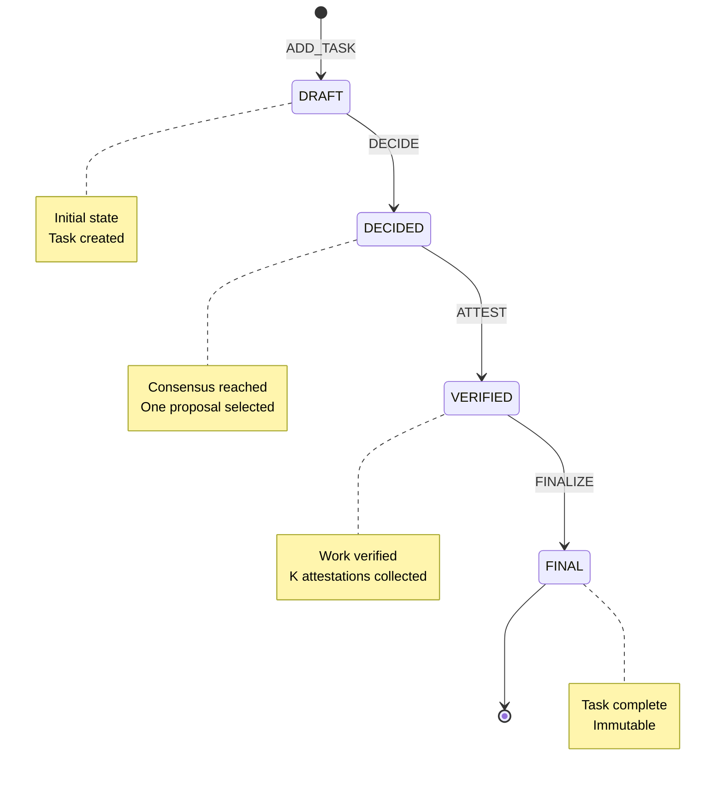
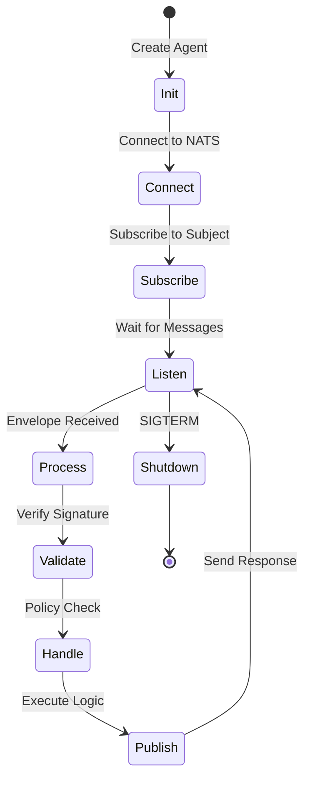

# Architecture Documentation

Comprehensive overview of CAN Swarm v1 architecture, data flows, and component interactions.

## Table of Contents

- [System Overview](#system-overview)
- [Component Architecture](#component-architecture)
- [Data Flow Diagrams](#data-flow-diagrams)
- [State Machines](#state-machines)
- [Message Flow](#message-flow)
- [Storage Architecture](#storage-architecture)
- [Consistency Model](#consistency-model)

---

## System Overview

CAN Swarm v1 is a centralized-but-deterministic cooperative AI system. All components communicate through a message bus, with every action cryptographically signed and logged for auditability.

### Core Principles

1. **Determinism**: Same inputs → Same outputs
2. **Auditability**: Every action is signed and logged
3. **Replayability**: Complete workflows can be reconstructed

### High-Level Architecture



---

## Component Architecture

### Layer 1: Infrastructure

```
┌─────────────────────────────────────────────────────┐
│                 Infrastructure Layer                 │
├─────────────────────────────────────────────────────┤
│  NATS JetStream  │  Redis  │  SQLite  │  Filesystem │
│  (Message Bus)   │ (Locks) │ (State)  │ (CAS/Logs)  │
└─────────────────────────────────────────────────────┘
```

- **NATS JetStream**: Persistent message queue with replay
- **Redis**: Atomic operations for consensus
- **SQLite**: CRDT-based plan store
- **Filesystem**: Content-addressable storage + audit logs

### Layer 2: Core Framework

```
┌─────────────────────────────────────────────────────┐
│                   Core Framework                     │
├──────────┬──────────┬──────────┬──────────┬─────────┤
│  crypto  │  audit   │  bus     │ envelope │ policy  │
│ (Ed25519)│ (JSONL)  │(Pub/Sub) │(Messages)│ (Rules) │
└──────────┴──────────┴──────────┴──────────┴─────────┘
```

- **crypto**: Cryptographic signing and verification
- **audit**: Append-only signed logging
- **bus**: NATS abstraction with envelope validation
- **envelope**: Message creation with Lamport clocks
- **policy**: Validation rules and enforcement

### Layer 3: State Management

```
┌─────────────────────────────────────────────────────┐
│                 State Management                     │
├─────────────────┬──────────────────┬────────────────┤
│   plan_store    │    consensus     │      cas       │
│ (Task State)    │  (DECIDE Lock)   │  (Artifacts)   │
│ SQLite CRDT     │  Redis LUA       │  SHA256-based  │
└─────────────────┴──────────────────┴────────────────┘
```

### Layer 4: Agent Framework

```
┌─────────────────────────────────────────────────────┐
│                  Agent Framework                     │
├──────────────┬──────────────┬──────────────┬────────┤
│  BaseAgent   │  Verbs       │  Handlers    │ Coord  │
│ (Lifecycle)  │ (Dispatch)   │  (Logic)     │(Inject)│
└──────────────┴──────────────┴──────────────┴────────┘
```

### Layer 5: Agents

```
┌─────────────────────────────────────────────────────┐
│                     Agents                           │
├──────────────┬──────────────┬──────────────────────┤
│   Planner    │    Worker    │      Verifier        │
│  (Propose)   │ (Execute)    │  (Validate+Finalize) │
└──────────────┴──────────────┴──────────────────────┘
```

---

## Data Flow Diagrams

### NEED → FINALIZE Flow



### Envelope Validation Flow



---

## State Machines

### Task State Machine



**State Transitions**:
- `DRAFT → DECIDED`: When consensus records a DECIDE
- `DECIDED → VERIFIED`: When K attestations received (K=1 in v1)
- `VERIFIED → FINAL`: When FINALIZE envelope processed

**Invariants**:
- States are monotonic (can only advance)
- Lamport clock enforces ordering
- Final state is immutable

### Agent Lifecycle



---

## Message Flow

### NATS Subject Patterns

```
thread.<thread-id>.<source>

Examples:
- thread.abc-123.need       (NEED published by user)
- thread.abc-123.planner    (PROPOSE from planner)
- thread.abc-123.worker     (COMMIT from worker)
- thread.*.need             (Subscribe to all NEEDs)
- thread.*.*                (Subscribe to all messages)
```

### Envelope Structure

```json
{
  "v": 1,
  "id": "uuid-v4",
  "thread_id": "thread-identifier",
  "kind": "NEED|PROPOSE|CLAIM|COMMIT|ATTEST|FINALIZE",
  "lamport": 42,
  "ts_ns": 1700000000000000000,
  "sender_pk_b64": "base64-encoded-public-key",
  "payload_hash": "sha256-hex",
  "payload": {...},
  "policy_engine_hash": "sha256-of-policy",
  "nonce": "uuid-v4",
  "sig_pk_b64": "base64-public-key",
  "sig_b64": "base64-signature"
}
```

### Message Types

| Kind | Publisher | Purpose | Artifact Required |
|------|-----------|---------|-------------------|
| NEED | User/Client | Request task execution | No |
| PROPOSE | Planner | Suggest execution plan | No |
| CLAIM | Worker | Claim task for execution | No |
| COMMIT | Worker | Submit work result | Yes (artifact_hash) |
| ATTEST | Verifier | Validate result | No |
| DECIDE | Coordinator | Record consensus | No |
| FINALIZE | Verifier | Mark complete | No |

---

## Storage Architecture

### Plan Store (SQLite)

```sql
CREATE TABLE ops (
    op_id TEXT PRIMARY KEY,
    thread_id TEXT,
    lamport INTEGER,
    actor_id TEXT,
    op_type TEXT,  -- ADD_TASK, STATE, ANNOTATE, etc.
    task_id TEXT,
    payload_json TEXT,
    timestamp_ns INTEGER
);

CREATE TABLE tasks (
    task_id TEXT PRIMARY KEY,
    thread_id TEXT,
    task_type TEXT,
    state TEXT,  -- DRAFT, DECIDED, VERIFIED, FINAL
    last_lamport INTEGER
);

CREATE TABLE edges (
    parent_id TEXT,
    child_id TEXT,
    PRIMARY KEY (parent_id, child_id)
);
```

**CRDT Semantics**:
- `ops` table is append-only (G-Set)
- `tasks` table uses LWW (Last-Write-Wins) based on Lamport clock
- State transitions are monotonic

### Consensus Store (Redis)

```
Key Pattern: decide:<need-id>
Value: JSON-encoded DecideRecord
{
  "need_id": "...",
  "proposal_id": "...",
  "epoch": 1,
  "lamport": 42,
  "k_plan": 1,
  "decider_id": "...",
  "timestamp_ns": ...
}
```

**Atomicity**: Lua script ensures at-most-once DECIDE per need.

### Content-Addressable Storage

```
Directory: .cas/
Files: .cas/<sha256-hash>
```

Example:
```
.cas/dffd6021bb2bd5b0af676290809ec3a53191dd81c7f70a4b28688a362182986f
```

**Properties**:
- Immutable (hash = content)
- Deduplication automatic
- Verifiable integrity

### Audit Log

```
File: logs/swarm.jsonl
Format: One JSON object per line

{
  "ts_ns": 1700000000000000000,
  "thread_id": "abc-123",
  "subject": "thread.abc-123.need",
  "kind": "BUS.PUBLISH",
  "payload_hash": "sha256-hex",
  "payload": {...},
  "version": 1,
  "sig_pk_b64": "...",
  "sig_b64": "..."
}
```

---

## Consistency Model

### Eventual Consistency

- Plan Store: Eventually consistent across operations
- Messages: At-least-once delivery (NATS JetStream)
- State: Converges via CRDT semantics

### Strong Consistency

- Consensus: Atomic DECIDE via Redis Lua script
- Lamport Clocks: Causal ordering guaranteed within agent
- Signatures: Immediate verification

### Conflict Resolution

1. **Lamport Clock**: Determines operation ordering
2. **LWW (Last-Write-Wins)**: Higher Lamport wins for task state
3. **G-Set (Grow-Only)**: Operations never deleted
4. **Consensus**: First DECIDE wins atomically

---

## Security Model

### Cryptographic Guarantees

```
┌─────────────┐
│   Message   │
└──────┬──────┘
       │
       v
┌─────────────┐     ┌──────────────┐
│  Hash SHA256│────>│ Sign Ed25519 │
└─────────────┘     └──────┬───────┘
                           │
                           v
                    ┌──────────────┐
                    │   Envelope   │
                    │  + Signature │
                    └──────────────┘
```

**Properties**:
- **Authenticity**: Ed25519 signatures prove sender
- **Integrity**: SHA256 hashes detect tampering
- **Non-repudiation**: Signatures are binding

### Trust Boundaries

```
┌─────────────────────────────────┐
│        Trusted Domain           │
│  ┌─────┐  ┌─────┐  ┌─────┐     │
│  │ P   │  │ W   │  │ V   │     │  All agents share
│  └─────┘  └─────┘  └─────┘     │  same signing key
│           Agents                 │  (v1 simplification)
└─────────────────────────────────┘
         │
         │ Signatures
         v
┌─────────────────────────────────┐
│      Audit Log / Replay         │  External verifiers
│    (Anyone can verify)          │  can validate all
└─────────────────────────────────┘  signatures
```

> **Note**: v1 uses single keypair for simplicity. v2 will implement per-agent keys with capability tokens.

---

## Performance Characteristics

### Throughput

- **Message Rate**: ~1000 msg/sec (NATS limit)
- **Envelope Validation**: <1ms average
- **Signature Verification**: ~0.1ms (Ed25519)
- **CAS Write**: ~1ms (local filesystem)

### Latency

| Operation | Typical Latency |
|-----------|----------------|
| NEED → PROPOSE | 100-500ms |
| PROPOSE → CLAIM | 10-50ms |
| CLAIM → COMMIT | 1-10s (work dependent) |
| COMMIT → ATTEST | 10-50ms |
| ATTEST → FINALIZE | 10-50ms |
| **Total E2E** | **1-15 seconds** |

### Scalability

**Current Limits** (v1):
- Single coordinator node
- Single NATS server
- Single Redis instance
- SQLite (local file)

**Future** (v2+):
- Distributed coordinators
- NATS cluster
- Redis cluster / etcd-raft
- Automerge CRDT sync

---

## Deployment Architecture

### Development (Current)

```
┌──────────────────────────────────────┐
│         Local Machine                 │
│                                       │
│  ┌────────┐  ┌────────┐  ┌────────┐ │
│  │ Coord  │  │ NATS   │  │ Redis  │ │
│  └────────┘  └────────┘  └────────┘ │
│  ┌────────┐  ┌────────┐  ┌────────┐ │
│  │Planner │  │ Worker │  │Verifier│ │
│  └────────┘  └────────┘  └────────┘ │
│                                       │
│  Files: .cas/, .state/, logs/        │
└──────────────────────────────────────┘
```

### Production (Future)

```
┌────────────┐    ┌────────────┐    ┌────────────┐
│  Coord 1   │    │  Coord 2   │    │  Coord 3   │
└─────┬──────┘    └─────┬──────┘    └─────┬──────┘
      │                 │                  │
      └─────────────────┼──────────────────┘
                        │
              ┌─────────┴──────────┐
              │   NATS Cluster     │
              │   Redis Cluster    │
              │   MinIO / S3       │
              └────────────────────┘
```

---

## See Also

- [API Documentation](API.md)
- [README](../README.md)
- [Implementation Roadmap](../IMPLEMENTATION_ROADMAP.md)
